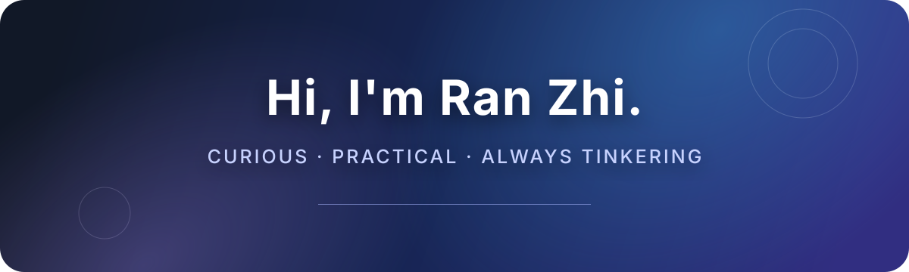

  

   

  **喜欢钻研技术，也享受把日常生活打磨得更顺手。**

   

  
  
  
  

## `01` 关于我

我喜欢研究技术。遇到感兴趣的问题，会从“能用”继续追到“为什么能用”，再想办法让它更稳定、更自然。

闲暇时主要折腾家庭媒体自动化，让下载、整理、入库和播放顺畅衔接。我也是 Apple 生态爱好者，喜欢软硬件配合得恰到好处的体验。

## `02` 我在意的事

| | |
|:--:|:--|
| 🔍 | **持续钻研** · 把问题弄明白，也把解决方案沉淀下来 |
| 🎬 | **媒体自动化** · 让复杂流程安静、可靠地在后台运行 |
| 🍎 | **体验与细节** · 好工具不仅要有用，也应该让人愿意长期使用 |
| 🧩 | **支持好软件** · 愿意为优秀的软件付费，也愿意花时间参与完善 |
| 🛠️ | **开源协作** · 从真实使用出发维护 Fork，并把通用改进贡献回社区 |

## `03` 最近在做

> 让家庭媒体服务更自动、更稳定，也更容易维护。

   
  保持好奇，认真折腾。

